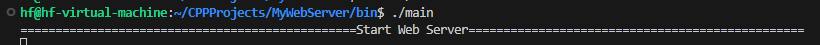
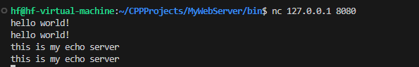
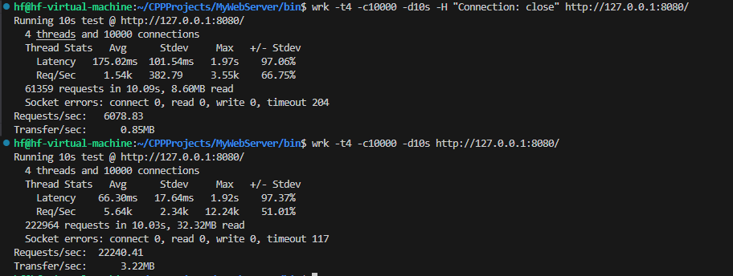

# webserver

## 项目介绍

本项目是一个高性能的WEB服务器，使用C++实现，项目底层采用了muduo库核心的设计思想，多线程多Reactor的网络模型，并且在这基础上增加了内存池，高效的双缓冲异步日志系统，以及LFU的缓存。

## 开发环境

* linux kernel version5.15.0-113-generic (ubuntu 22.04.6)
* gcc (Ubuntu 11.4.0-1ubuntu1~22.04) 11.4.0
* cmake version 3.22

## 目录结构

```shell
MyWebserver/
├── img/ #存放图片
├── include/ #所有头文件.h位置
├── lib/ #存放共享库
|
├── src/ # 源代码目录
│ ├── main.cpp # 主程序入口
│ ├── ... # 其他源文件 
|
|── scripts/ # 脚本目录
├── CMakeLists.txt # CMake 构建文件
└── README.md # 项目说明文件
```

## 核心架构
● 采用Reactor模式，基于事件驱动的网络编程模型<br>
● 使用多线程设计，包含主线程（EventLoop）和工作线程池<br>
● 基于epoll实现的高效事件处理机制<br>

## 主要组件：
● 网络层：<br>
  &emsp;○ TcpServer：服务器核心类，管理连接和事件循环<br>
  &emsp;○ TcpConnection：TCP连接管理<br>
  &emsp;○ Acceptor：负责接受新连接<br>
  &emsp;○ Buffer：网络数据缓冲区<br>
  &emsp;○ Channel：事件通道，封装了文件描述符和事件处理<br>
● 事件循环：<br>
  &emsp;○ EventLoop：事件循环核心类<br>
  &emsp;○ EventLoopThread：事件循环线程<br>
  &emsp;○ EventLoopThreadPool：事件循环线程池<br>
  &emsp;○ Poller/EPollPoller：事件轮询器<br>
● 日志系统：<br>
  &emsp;○ Logger：日志记录器<br>
  &emsp;○ AsyncLogging：异步日志系统<br>
  &emsp;○ LogStream：日志流<br>
  &emsp;○ LogFile：日志文件管理<br>
● 内存管理：<br>
  &emsp;○ MemoryPool：内存池实现<br>
  &emsp;○ 支持多种大小的内存块分配（8-512字节）<br>
  &emsp;○ 线程安全的内存分配和释放<br>
● 缓存系统：<br>
  &emsp;○ LFU：最近最少使用缓存策略<br>
  &emsp;○ ConsistenHash：一致性哈希实现<br>

## 前置工具准备

安装基本工具

```bash
sudo apt-get update
sudo apt-get install -y wget cmake build-essential unzip git
```

## 编译指令
1. 克隆项目：
```bash
   git clone git@github.com:FlYwithcoder/MyWebServer.git
   cd MyWebserver
```

2. 创建构建目录并编译：

```bash
  cd ./scripts/
  sh build.sh
```

3. 在构建完成后，先进入到bin文件

```bash
cd bin
```

4. 启动项目可执行程序main

```bash
./main 
```

**注意**：需要再另外开一个新窗口运行`curl -v 127.0.0.1:8080/index.html`启动我们的客户端，来链接main可执行程序启动的web服务器

## 运行结果
通过运行项目中bin文件下可执行程序main，会出现如下结果：

其中日志文件将存放bin文件下的 `logs` 目录中，每次运行程序时，都会生成新的日志文件，记录程序的运行状态和错误信息。

- 服务器的，运行结果如图



- 客户端的，运行结果如图
 


- 压力测试，虚拟机是4核4G
  

---

